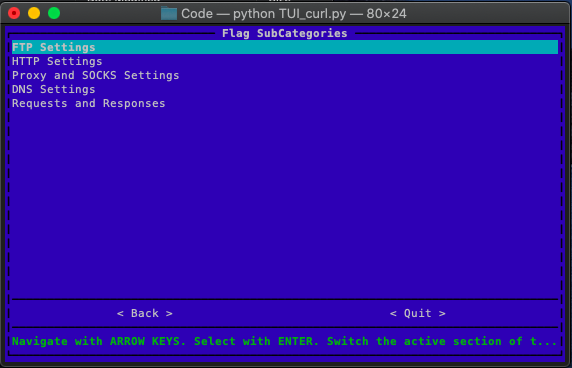
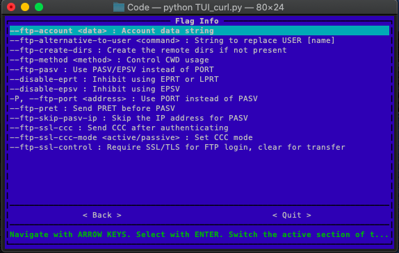

# TUI-Manual

A text based User Interface to simplify long manual pages of Command Line Applications. The commands are categorized according to the task needed to be achieved. The TUI is created in Python using the [Asciimatics](https://asciimatics.readthedocs.io/en/stable/) library.

